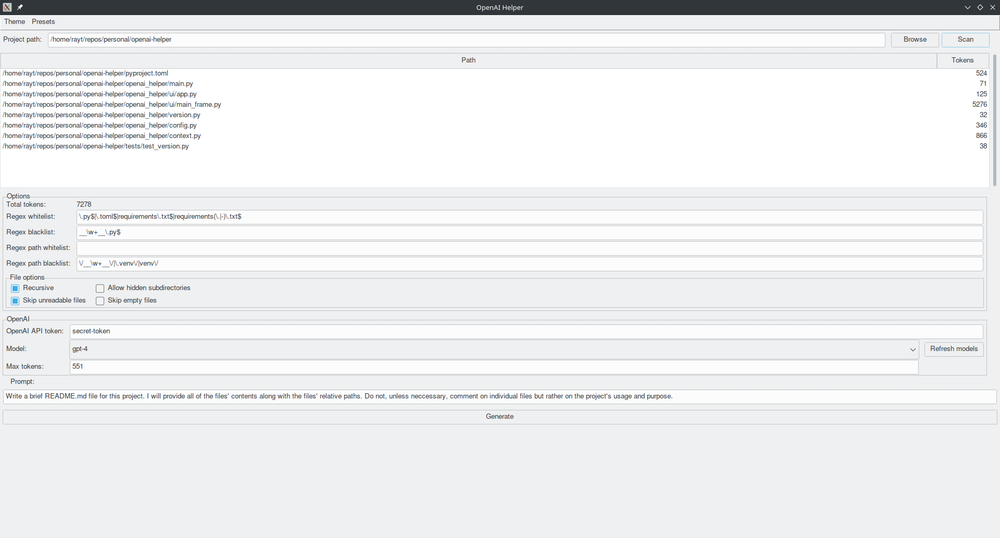

# OpenAI Helper

Following text was (apart from the GUI screenshots) generated using OpenAI GPT4 model using this application.

This application allows you to pass multiple files to ChatGPT as a context at once.

OpenAI Helper is a Python package that allows you to interact with OpenAI API using a simple GUI. It lets you generate completions for your given prompts with the chosen model from OpenAI's models list. The package is designed to be easy to set up and use, making it a helpful tool for developers working with OpenAI API.

## Key Features

- Simple and easy-to-use GUI interface
- Customizable filtering options for files to include in the context
- Integrated support for OpenAI API
- Comprehensive settings for choosing the model, API token, and other parameters
- Configurable presets for faster setup

## Installation

To install the OpenAI Helper package, clone it and use poetry to install dependencies:

```bash
git clone https://github.com/tomasvotava/openai-helper.git
cd openai-helper
poetry install
```

Alternatively, you can use `pip` to install the package:

```bash
git clone https://github.com/tomasvotava/openai-helper.git
cd openai-helper
pip install -r requirements.txt
```

## How to Use

To start using the OpenAI Helper GUI, run the following command:

```bash
poetry run python -um openai_helper.main
```

You can then configure your OpenAI API token, select a model, set the token limit and set up the files filtering options according to your requirements. Once everything is set up, you can input your prompt and click on the "Generate" button to get the completions from the chosen OpenAI model.



## Dependencies

OpenAI Helper uses the following packages:

- openai: `^0.27.8`
- env-proxy: `^0.1.1`
- tiktoken: `^0.4.0`
- python-dotenv: `^1.0.0`
- tk: `^0.1.0`
- ttkthemes: `^3.2.2`

Additionally, the development dependencies are listed in the `pyproject.toml` file.

## License

This project is created by Tomas Votava (<info@tomasvotava.eu>) and is available under the MIT License.
